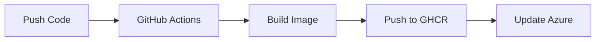

# Azure Scheduled Job to Container Apps Migration

A complete tutorial demonstrating the migration path from Windows scheduled executables to Azure Container Apps, with practical examples and production-ready code.

## 📁 Project Structure

### Phase 1: P1_SampleConsoleJob
**Purpose**: Original .NET 8 console application demonstrating traditional Windows scheduled job patterns.
- Singleton instance management using mutex and file locking
- Configurable sleep duration to simulate long-running processes
- Comprehensive logging and error handling
- Unit tests included in `P1_SampleConsoleJob.Tests/`

**Use Case**: Starting point representing legacy Windows scheduled jobs.

### Phase 2: P2_Docker
**Purpose**: Introduction to Docker containerization fundamentals.
- Basic Dockerfile for .NET 8 runtime
- Docker Compose configuration
- No application code - purely educational

**Use Case**: Learn Docker basics before containerizing your application.

### Phase 3: P3_DockerConsoleJob
**Purpose**: Containerized version of the console application.
- Multi-stage Docker build for optimized images
- Removed mutex logic (not needed in containers)
- Production-ready container configuration
- Local testing with docker-compose

**Use Case**: See how to properly containerize a .NET application.

### Phase 4: P4_DockerConsoleJob_GHCR
**Purpose**: Production deployment with CI/CD pipeline.
- GitHub Actions workflow for automated builds
- GitHub Container Registry (GHCR) for image storage
- Azure Container Apps deployment
- Complete deployment documentation

**Use Case**: Production-ready cloud deployment with full automation.

## 🚀 Quick Start

### Prerequisites
- Docker Desktop installed
- Azure CLI installed
- GitHub account
- Azure subscription

### Deploy to Azure (Phase 4)

1. **Setup Azure Resources**:
```bash
az group create --name rgDCJ --location eastus
az containerapp env create --name docker-console-env --resource-group rgDCJ --location eastus
```

2. **Deploy the Application**:
```bash
cd P4_DockerConsoleJob_GHCR
./deploy.sh
```

## 📊 Architecture Evolution

```
P1: Windows Server → Task Scheduler → .EXE → Manual Deployment
                ↓
P2: Learn Docker Basics
                ↓
P3: Application → Docker Container → Local Testing
                ↓
P4: GitHub → Actions → GHCR → Azure Container Apps → Automated
```

## ⏱️ Time Comparison

| Approach | Developer Time | Complexity |
|----------|---------------|------------|
| Containerization | 1-8 hours | Add Dockerfile, test, deploy |
| Functions (1 function - this app) | 2-4 hours | Simple conversion, but rarely realistic |
| Functions (4-6 functions - typical) | 3-5 days | Split logic, handle orchestration |
| Functions (8-12 functions) | 2-3 weeks | Complex orchestration, state management |
| Functions (20+ functions) | 1-2 months | Full distributed system |

## 📖 Documentation

- [Migration Guidance](docs/MIGRATION_GUIDANCE.md) - Detailed architectural decisions and ROI analysis
- [Azure Deployment](docs/AZURE_DEPLOYMENT.md) - Production deployment strategies
- [Project Requirements](docs/PRD_Scheduled_Job_Migration.md) - Original project requirements

## 🔄 CI/CD Pipeline

The project includes GitHub Actions workflow that:
1. **Triggers** on push to P4 folder
2. **Builds** Docker image automatically
3. **Pushes** to GitHub Container Registry
4. **Ready** for Azure deployment



## 🎯 Key Learning Outcomes

1. **Containerization is simple**: 1-8 hours actual work time
2. **Platform handles complexity**: Delete 500+ lines of instance management code
3. **Avoid unnecessary refactoring**: Keep your working code intact
4. **Maintain flexibility**: Containers run anywhere (Azure, AWS, on-premises)

## 🏗️ Migration Timeline (Actual)

- **Phase 1 → Phase 3**: 2 hours (containerization)
- **Phase 3 → Phase 4**: 1 hour (deployment setup)
- **Total Time**: 3 hours from legacy to cloud

Compare to typical timelines:
- **Functions Refactoring**: 2-6 months minimum
- **Microservices Rewrite**: 6-12 months

## 🛠️ Technology Stack

- **.NET 8.0** - Modern cross-platform runtime
- **Docker** - Containerization
- **GitHub Actions** - CI/CD pipeline
- **GitHub Container Registry** - Free private image storage
- **Azure Container Apps** - Serverless container hosting

## 📝 Repository Structure

```
/
├── P1_SampleConsoleJob/        # Original console application
│   ├── Program.cs
│   ├── InstanceManager.cs
│   └── README.md
├── P1_SampleConsoleJob.Tests/  # Unit tests
├── P2_Docker/                  # Docker basics
│   ├── Dockerfile
│   └── docker-compose.yml
├── P3_DockerConsoleJob/        # Containerized application
│   ├── Dockerfile
│   ├── Program.cs
│   └── docker-compose.yml
├── P4_DockerConsoleJob_GHCR/   # Production deployment
│   ├── Dockerfile
│   ├── deploy.sh
│   └── AZURE_SETUP_INSTRUCTIONS.md
├── .github/workflows/          # CI/CD pipelines
├── docs/                       # Documentation
└── README.md                   # This file
```

## 🤝 Contributing

This is an educational project demonstrating migration patterns. Feel free to:
- Use as a template for your own migrations
- Submit issues for questions
- Share your migration success stories

## 📄 License

MIT - Use this code freely in your own projects

## 🎥 Learn More

This project demonstrates why containerization is often superior to Functions refactoring for complex batch jobs. The code proves:
- Faster migration (hours vs months)
- Less risk (minimal code changes)
- Better portability (no vendor lock-in)
- Working code stays working

---

*Built to demonstrate pragmatic cloud migration over architectural extremism.*