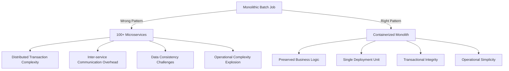

# Windows Scheduled Job to Azure Container Apps Migration Guide
## An Architectural Decision Record for Enterprise Modernization

## Executive Summary

This document presents a pragmatic cloud migration strategy for complex, long-running scheduled jobs currently executing on Windows infrastructure. Our approach prioritizes **business continuity**, **minimal refactoring risk**, and **rapid time-to-value** while establishing a foundation for future modernization initiatives.

**Key Recommendation**: Migrate existing scheduled jobs to Azure Container Apps using a containerization strategy that preserves current business logic while gaining cloud benefits immediately.

## The Business Challenge

### Current State Architecture
Your organization maintains mission-critical scheduled jobs with the following characteristics:
- **Monolithic design** - 5-10 years of accumulated business logic (50,000+ lines of code)
- **Complex orchestration** - Sequential processing with 20+ distinct steps
- **Long-running transactions** (30-90 minutes per execution)
- **Multiple system dependencies** (10+ APIs, 3+ databases, legacy mainframe systems)
- **Batch processing requirements** (processing 100,000+ records per run)
- **Regulatory compliance** - Audit trails, data retention, SOX compliance

### Infrastructure Pain Points
- Server maintenance windows and patching
- Hardware refresh cycles every 3-5 years
- Disaster recovery infrastructure duplication
- On-call support for server failures
- Manual deployment processes

## Architectural Decision: Why Not Azure Functions?

### The Microservices Refactoring Trap

**Attempting to decompose a monolithic batch job into microservices is an anti-pattern that introduces unnecessary complexity and risk.**

#### The Real Cost: Development Time ROI Analysis

**Containerization vs Functions Refactoring - Actual Developer Hours**

| Approach | Actual Developer Time | Reality Check |
|----------|---------------------|---------------|
| **Containerization** | 1-8 hours | Add Dockerfile, environment variables, test |
| **Functions (1 function only)** | 2-4 hours | Simple port, but most real apps need multiple functions |
| **Functions (4-6 functions - typical)** | 3-5 days | Split job steps, add orchestration, test interactions |
| **Functions (8-12 functions)** | 2-3 weeks | State management, error handling across functions |
| **Functions (20+ functions)** | 1-2 months | Full distributed system, complex debugging |

**Debugging Complexity: How It Scales With Application Size**

| Application Size | Container Debugging | Functions Debugging | Why the Difference |
|-----------------|-------------------|-------------------|-------------------|
| **Simple** (This app: 1K lines) | Same as today - single process, familiar tools | 5-10 Functions, distributed logs | Even simple apps become distributed |
| **Medium** (10-50K lines) | Still single process, same debugger | 50-100 Functions, correlation IDs required | Exponential complexity growth |
| **Large** (100K+ lines) | Same debugging approach, just bigger logs | 200+ Functions, distributed tracing mandatory | Nightmare scenario |

```
Container Debugging (All Sizes):
- Set breakpoint in IDE
- Step through code normally
- See complete execution flow
- One log stream to analyze

Functions Debugging (Gets Worse With Scale):
- Simple App: Track 10 function invocations
- Medium App: Correlate 100+ function calls
- Large App: Distributed tracing across 200+ functions
- Each function = separate log stream
```

```
Why refactor working code that doesn't need refactoring?
- Current code: Battle-tested for 5+ years, handles edge cases
- Functions rewrite: Introduces new bugs, new edge cases
- Business value of rewrite: ZERO additional features
- Technical debt created: Vendor lock-in to proprietary Functions runtime
```

#### Architectural Principles Violated by Functions Migration

**YAGNI (You Aren't Gonna Need It)**
- You don't need microservices for a batch job
- You don't need event-driven architecture for scheduled processing
- You don't need serverless scaling for predictable workloads

**KISS (Keep It Simple, Stupid)**
- Current: 1 deployment unit, 1 log stream, 1 monitoring point
- Functions: 50+ deployment units, 50+ log streams, distributed tracing required

**Vendor Lock-in Considerations**
```
Container Approach:
- Standard Docker containers run anywhere (AWS, GCP, on-premises)
- Your code remains YOUR code - no proprietary runtime dependencies
- Exit strategy: Deploy same container to any Kubernetes cluster

Functions Approach:
- Tightly coupled to Azure Functions runtime
- Bindings, triggers, and extensions are Azure-specific
- Exit strategy: Complete rewrite required
```

#### Understanding Azure Functions' Sweet Spot

**Azure Functions excel in specific scenarios - let's use the right tool for the right job.**

```
Where Functions Shine (Use Functions Here):
✓ HTTP APIs with sub-second response times
✓ Event-driven processing (ServiceBus, EventHub triggers)
✓ Simple webhooks and callbacks
✓ Lightweight scheduled tasks (< 5 minutes)
✓ Real-time stream processing
✓ Serverless APIs for mobile apps

Where Container Apps Excel (Use Containers Here):
✓ Long-running batch jobs (> 10 minutes)
✓ Complex workflows requiring orchestration
✓ Large dataset processing
✓ Legacy application migrations
✓ Stateful operations
✓ Applications requiring specific runtimes or dependencies
```

**A Balanced Architectural View**

Both technologies have their place in a modern cloud architecture. The key is matching the technology to the workload pattern:

- **Functions**: Event-driven, stateless, short-duration
- **Container Apps**: Batch processing, stateful, long-running

**Microsoft Azure Documentation:**
*"For long-running executions, we recommend Azure Container Instances or Container Apps"*
- [Microsoft Azure Documentation - Choose between Azure Functions and Azure Logic Apps](https://learn.microsoft.com/en-us/azure/azure-functions/functions-compare-logic-apps-ms-flow-webjobs#compare-azure-functions-and-azure-logic-apps)

See also: [When to use Container Apps vs Functions](https://learn.microsoft.com/en-us/azure/container-apps/compare-options)

**Architectural Facts:**
- Functions timeout: 10 minutes (Consumption) / 60 minutes (Premium)
- Container Apps timeout: No limit
- Functions are event-driven; Container Apps support both event-driven and long-running
- Functions require refactoring monoliths; Containers run existing code unchanged

#### Technical Limitations of Functions for Batch Processing

| Constraint | Azure Functions Limit | Your Requirement | Business Impact |
|------------|---------------------|------------------|-----------------|
| Execution timeout | 10 min (Consumption) / 60 min (Premium) | 45-90 minutes | Job failures, incomplete processing |
| Memory allocation | 1.5 GB (Consumption) / 14 GB (Premium) | 8-16 GB for large datasets | Out of memory errors |
| Concurrent connections | Limited connection pooling | 50+ database connections | Connection exhaustion |
| File system | 500 MB temp storage | 10 GB for report generation | Storage limitations |
| Cold start latency | 10-45 seconds | Immediate execution for SLA | Missed processing windows |

#### Architectural Impedance Mismatch



## The Strategic Solution: Containerization with Azure Container Apps

### Preserving Your Intellectual Property

**Your code is your competitive advantage. Keep it that way.**

#### Code Ownership & Portability Matrix

| Aspect | Container Apps | Azure Functions |
|--------|---------------|-----------------|
| **Code Ownership** | 100% your code, unchanged | Refactored to fit Functions model |
| **Runtime Control** | Standard .NET runtime you control | Azure Functions runtime controls you |
| **Portability** | Deploy to AWS ECS, Google Cloud Run, anywhere | Azure-only |
| **Testing** | Same local debugging as today | Functions emulator required |
| **CI/CD Pipeline** | Your existing DevOps process | Functions-specific deployment |
| **Disaster Recovery** | Run on-premises if needed | Cloud-only |

### Why This Architecture Makes Business Sense

#### **1. Minimal Cloud Adaptation, Maximum Benefit**
```yaml
What Actually Changes (Minor Tweaks Only):
- Add Dockerfile (12 lines)
- Replace hard-coded connection strings with environment variables
- Switch from Windows Auth to Managed Identity (1-2 hours)
- Optional: Replace file paths with cloud storage (if needed)

What You Can DELETE (Cloud Handles This):
- Mutex/Singleton instance management code (200+ lines)
- Windows Task Scheduler error handling
- Process checking and duplicate prevention logic
- Custom logging to Windows Event Log

Total: Add 50 lines, DELETE 200+ lines = NET REDUCTION in code

What Stays Exactly the Same:
- 99.8% of your business logic
- Your algorithms and processing flow
- Your core error handling
- Your testing procedures
- Your debugging workflow
```

#### **2. Risk Mitigation Through Simplicity**

```
Migration Risk Assessment:

Container Approach:
✓ Existing code continues to work
✓ Rollback = redeploy to Windows
✓ Testing = run container locally
✓ Production issues = same debugging tools
Risk Level: LOW

Functions Rewrite:
✗ New code with new bugs
✗ Rollback = impossible after refactoring
✗ Testing = learn new testing paradigms
✗ Production issues = distributed system debugging
Risk Level: EXTREME
```

#### **3. Real ROI Calculation**

```
Container Approach - What We Actually Did:
Hour 1: Created Dockerfile, tested locally
Hour 2: Added environment variables for config
Hour 3: Deployed to Azure Container Apps
Done.

What changed in the code:
- Added 12-line Dockerfile
- Changed hard-coded configs to environment variables
- That's it. Everything else stayed the same.

Functions Alternative - Real Timeline:
Month 1: Analysis and design decomposition
Month 2-3: Refactoring monolith into microservices
Month 4-5: Integration testing and bug fixes
Month 6+: Still fixing edge cases in production

Why the huge difference?
- Containers: Your code stays the same, just runs in a container
- Functions: Complete architectural change, new patterns, new bugs
```

## The Hidden Benefit: Deleting Infrastructure Code

### Instance Management - Let the Platform Handle It

**On Windows Server, preventing duplicate job execution requires:**
```csharp
// 200+ lines of fragile code
private static Mutex mutex = new Mutex(true, "GlobalMyJobMutex");
private static bool CheckForDuplicateProcess() { /* complex logic */ }
private static void WritePIDFile() { /* file locking code */ }
private static void HandleMutexTimeout() { /* error recovery */ }
// Plus: Race conditions, orphaned locks, mutex abandonment issues
```

**On Azure Container Apps:**
```yaml
parallelism: 1  # Done. Azure guarantees single instance.
```

| What You Delete | Lines of Code | Bugs Eliminated |
|-----------------|---------------|-----------------|
| Mutex/singleton management | 200-300 | Race conditions, deadlocks |
| Process enumeration | 50-100 | False positives, PID reuse |
| Lock file handling | 100-150 | Orphaned locks, NFS issues |
| Windows Task Scheduler workarounds | 150-200 | Scheduling conflicts |
| **Total Removed** | **500-750 lines** | **Dozens of edge cases** |

**This isn't adding cloud complexity - it's removing Windows complexity.**

## Migration Strategy: Three-Phase Approach

### Phase 1: Modernize the Application
**Objective**: Transform Windows executable to containerizable .NET console app

**Key Improvements**:
```csharp
// Before: Windows-specific scheduling
// Windows Task Scheduler + .exe

// After: Self-contained console application
public class Program
{
    public static async Task Main(string[] args)
    {
        // Dependency injection
        // Structured logging
        // Configuration management
        // Graceful shutdown handling
    }
}
```

**Best Practices Implemented**:
- **Dependency Injection** - Testable, maintainable code
- **Structured Logging** - JSON logs for cloud monitoring
- **Configuration** - Environment-based settings
- **Health Checks** - Application status monitoring
- **Graceful Shutdown** - Handle SIGTERM signals properly

### Phase 2: Containerization Foundation
**Objective**: Learn Docker fundamentals without application complexity

**Container Best Practices**:
```dockerfile
# Multi-stage builds for smaller images
FROM mcr.microsoft.com/dotnet/sdk:8.0 AS build
FROM mcr.microsoft.com/dotnet/runtime:8.0-alpine AS runtime

# Non-root user for security
USER appuser

# Minimal attack surface
FROM alpine-based images
```

**Security Principles**:
- **Least Privilege** - Non-root container execution
- **Minimal Base Images** - Reduced attack surface
- **Image Scanning** - Vulnerability detection
- **Secrets Management** - No hardcoded credentials

### Phase 3: Production-Ready Containerized Application
**Objective**: Combine application with Docker for cloud deployment

**Cloud-Native Design Patterns**:

#### **Instance Management Evolution**
```csharp
// Phase 1: Local instance management
private static Mutex _mutex = new("MyApp_SingleInstance");

// Phase 3: Cloud-managed instances
// Azure Container Apps handles single instance
// Remove local mutex logic - cloud orchestration manages this
```

#### **Configuration Management**
```csharp
// Phase 1: App.config files
// Phase 3: Environment variables + Azure Key Vault
services.Configure<AppSettings>(
    context.Configuration.GetSection("AppSettings"));
```

#### **Logging Strategy**
```csharp
// Phase 1: File-based logging
// Phase 3: Structured JSON logging to stdout
services.AddLogging(builder =>
    builder.AddJsonConsole());
```

## Azure Container Apps Architecture

### Single Instance Guarantee
```yaml
# Container Apps Job Configuration
spec:
  template:
    parallelism: 1                    # Only 1 pod at a time
    completions: 1                    # Single successful completion
    backoffLimit: 0                   # No automatic retries
  schedule: "0 2 * * *"              # Daily at 2 AM
  successfulJobsHistoryLimit: 5       # Keep last 5 successful runs
```

### Resource Management
```yaml
resources:
  requests:
    cpu: "1000m"      # 1 CPU core guaranteed
    memory: "2Gi"     # 2GB memory guaranteed
  limits:
    cpu: "2000m"      # Max 2 CPU cores
    memory: "4Gi"     # Max 4GB memory
```

### Monitoring and Alerting
```kql
// Log Analytics Query - Detect Multiple Instances
ContainerAppConsoleLogs_CL
| where ContainerName_s == "scheduled-job"
| summarize Instances = dcount(PodName_s) by bin(TimeGenerated, 5m)
| where Instances > 1
```

## Best Practices Summary

### **1. Cloud-Native Design**
- **Stateless Applications** - No local file dependencies
- **Environment-Based Configuration** - 12-factor app principles
- **Health Endpoints** - Kubernetes-style health checks
- **Graceful Shutdown** - Handle container lifecycle events

### **2. Security by Design**
- **Managed Identity** - No service principal secrets
- **Principle of Least Privilege** - Minimal required permissions
- **Container Security** - Non-root users, minimal base images
- **Network Isolation** - Private endpoints, VNet integration

### **3. Operational Excellence**
- **Infrastructure as Code** - Bicep/ARM templates
- **CI/CD Pipelines** - Automated build and deployment
- **Monitoring** - Application Insights, Log Analytics
- **Disaster Recovery** - Multi-region deployment capability

### **4. Cost Optimization**
- **Scale-to-Zero** - No cost when not running
- **Right-Sizing** - Appropriate CPU/memory allocation
- **Scheduled Execution** - Run only when needed
- **Shared Resources** - Container Apps Environment reuse

## The Architect's Perspective: Why This Is Good Engineering

### Architectural Soundness

**"Good architecture maximizes the number of decisions NOT made." - Robert C. Martin**

Container Apps embodies this principle:
- **No premature optimization** - Don't break apart what works together
- **Reversible decisions** - Containers can move anywhere
- **Progressive modernization** - Containerize now, refactor later (if needed)
- **Complexity budget preserved** - Save complexity for business features, not infrastructure

### Team Velocity & Morale

```
Current Team Impact:
- Developers: Continue using familiar tools and patterns
- Operations: Simplified deployment and monitoring
- Business: Faster delivery of new features

Functions Refactoring Impact:
- Developers: 18 months of refactoring instead of new features
- Operations: Learning curve for distributed systems
- Business: Feature freeze during migration
```

## Recommendations for Stakeholders

### To Infrastructure Teams
**"This approach respects your existing investments while providing cloud benefits."**
- Your monitoring tools still work (same application, just containerized)
- Your security scanning applies (container images are just artifacts)
- Your compliance controls remain (same code, same audit trail)

### To Development Teams
**"Write code, not plumbing."**
- Keep building business features, not refactoring for refactoring's sake
- Use your existing IDE, debugger, and toolchain
- Deploy with confidence - same code that works today

### To Management
**"Deliver value quickly with minimal risk."**
- 1-8 hour migration vs 2-6+ month rewrite
- Days vs months of developer time
- Proven technology (containers) vs architectural experiment
- Retain flexibility to change cloud providers if needed

**Warning Signs You're Being Sold Snake Oil:**
- "Everything should be serverless/Functions"
- "Microservices are always better"
- "You need to modernize everything"
- "Containers are old technology"

**The Truth:** Functions are great for their intended purpose. Batch jobs aren't it.

## Conclusion: The Pragmatic Path Forward

**Containerization represents the optimal balance between modernization and pragmatism.**

By choosing Container Apps over Functions for complex batch jobs, you:
1. **Preserve** years of battle-tested business logic
2. **Minimize** migration risk and timeline
3. **Maintain** architectural flexibility and vendor independence
4. **Maximize** ROI through rapid deployment
5. **Enable** future modernization when business value justifies it

### The Technical Decision

For complex batch processing workloads with 30+ minute execution times and multi-system dependencies, Azure Container Apps provides the appropriate compute model. This aligns with Microsoft's own architectural guidance for long-running processes.

**Decision: Use Container Apps for this workload pattern.**

---
*"Perfection is achieved not when there is nothing left to add, but when there is nothing left to take away." - Antoine de Saint-Exupéry*